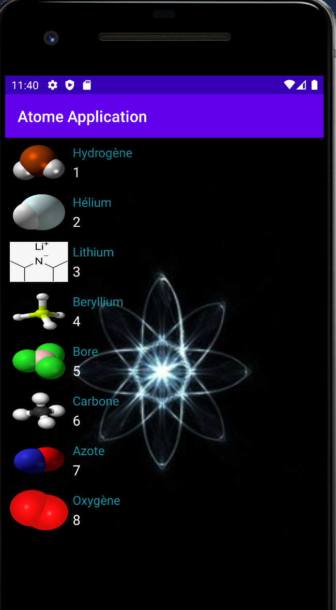
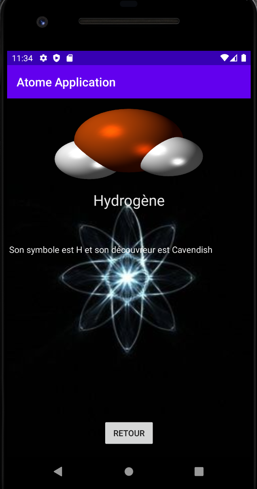
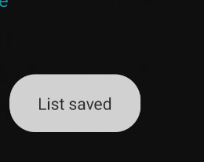

# Atome Application
Projet de troisième année à l'ESIEA. Le but de cette application est de regrouper tout les atomes du tableau des élements.

## Les Prérequis

- Installation d'Android Studio
- Connexion Internet pour utilisation de l'API

https://github.com/Dunniii/Application3A/

## Fonctionnalités et Conception

- Appels REST
- Affichage d'une liste avec RecyclerView
- Affichage du détail d'un élément de la liste
- Clean Architecture & MVC
- Stockage en cache de la liste des élément et détails
- Design

## Screens

### Premier Ecran (SplashScreen)

- Affiche  une liste

### Second Ecran (Liste RecyclerView)

- Affiche la liste des Pokemon

### Troisième Ecran (Details Elément)

- Affiche le détail d'un élément de la liste

