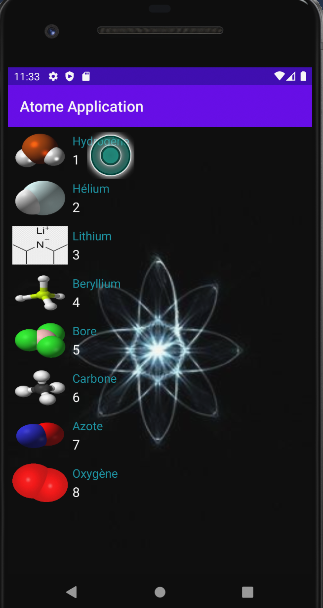

# Application3A
Projet de troisième année à l'ESIEA. Le but de cette application est de regrouper tout les atomes du tableau des élements.

## Présentation

Simple projet démontrant l'utilisation de Clean Architecture et du pattern MVVM dans une application android codé en Kotlin.

Cette application une liste d'atome et utilise l'API de Github permettant d'aller chercher mon fichier AtomeApi.json. L'API 
sera complétée petit à petit.

## Prérequis

- Installation d'Android Studio
https://github.com/Dunniii/Application3A/

## Consignes respectées : 

- Clean Architecture & MVVM
- Appels REST
- Ecrans : 2 fragment et un SplashScreen non fini
- Affichage d'une liste dans un RecyclerView
- Affichage du détail d'un item de la liste

## Fonctionnalités: 

### Premier écran 

   

### Ecran du détail du pokémon

- Affiche les différentes informations sur le pokémon 
- Puces type, weaknesses, previous evolution et next evolution sont cliquables 
- Redirection en fonction de la puce  :
	- Type, weaknesses : Vers la liste des pokémons du type selectionné 
	- Evolution : Vers le détail du pokémon selectionné

